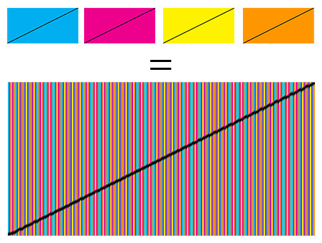

## ImageSlicer (Lenticular)

This simple app takes images as input and creates a lenticular image as result.

- Variable image count, e.g. `4 images`
- Variable slice width, e.g. `3px`
- Variable pattern, e.g. `A-B-C-B-A-D`

Example:

See: http://en.wikipedia.org/wiki/Lenticular_printing